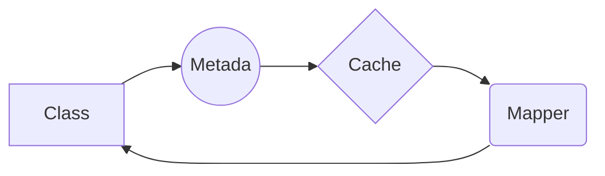

# :warning: THIS PACKAGE IS UNDER DEVELOPING AND THIS IS NOT IN NPM REPOSITORY YET

# :rocket: mongoose-model-ts

mongoose-model-ts is a package for Typescript node proyect to use mongoose in a type way.

## Getting Started

Here is a basic example of how you can use the package:

### Prerequisites


* TypeScript 3.7+
* Node 8.10+
* mongoose ^5.9.2


### Installing

Download this package using npm

```
npm i --save mongoose-model-ts
```


## Example: Lets code

### With JS mongoose:

```js
const  mongoose  =  require('mongoose');
const { Schema } = mongoose;
const { ObjectId } = Schema.Types;

const  PersonSchema  =  new  Schema({
	name: { type:  String },
	age: { type:  Number, required:  false },
})

mongoose.model('Person', PersonSchema);
```

### With TS mongoose:
```ts
import { prop, Model } from  'mongoose-model-ts'

export  class  Person  extends  Model {

	@prop()
	name:  string;

	@prop({ required:  false })
	age:  number;
}
```

## How it works

Mongoose TS map the properties of the model and create a schema in the metadata of the class. All is transparent for the developer and for this they don't need get worry about how its work.





## License

This project is licensed under the MIT License - see the [LICENSE](LICENSE) file for details

